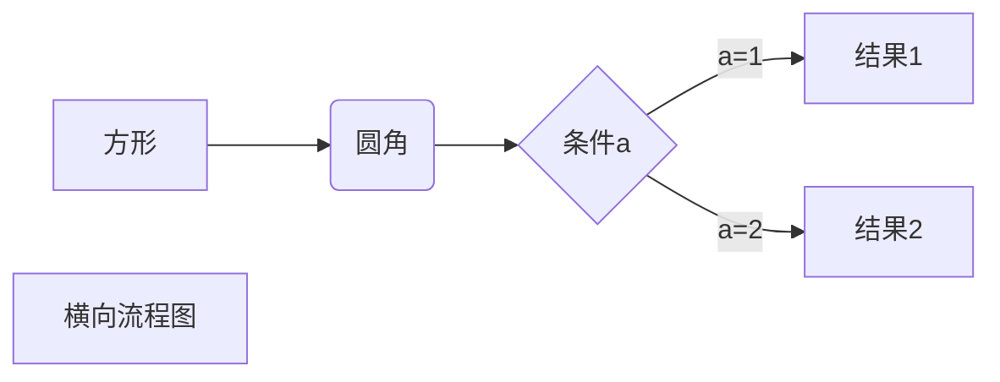
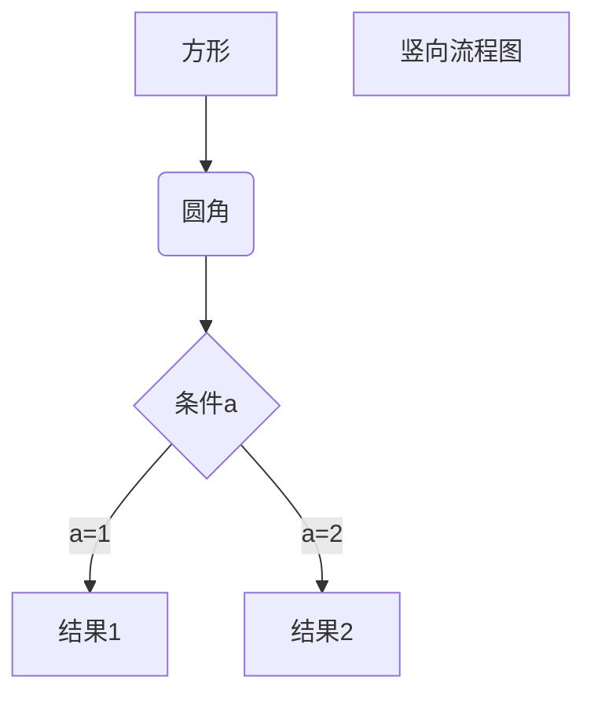
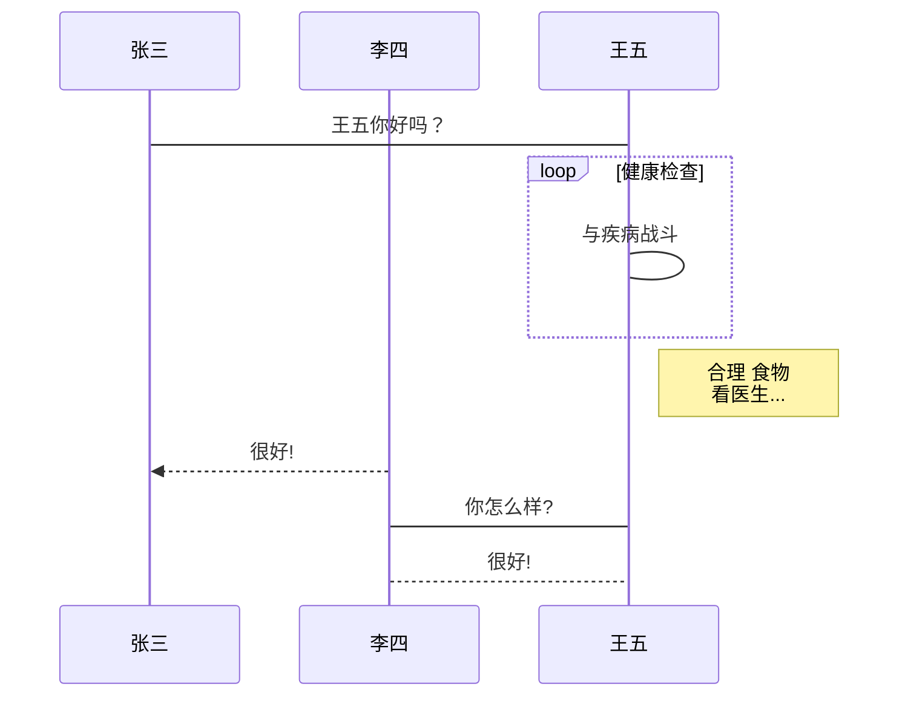
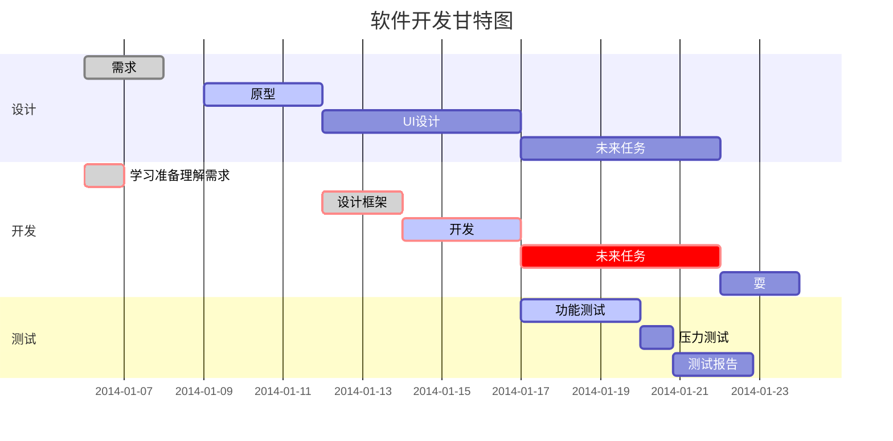

1：标题

使用 = 和 - 标记一级和二级标题

我展示的是一级标题
=================
我展示的是二级标题
-----------------


使用 # 号可表示 1-6 级标题，一级标题对应一个 # 号，二级标题对应两个 # 号，以此类推。
# 一级标题
## 二级标题
### 三级标题
#### 四级标题
##### 五级标题
###### 六级标题

2：段落、字体、分割线、删除线、下划线、脚注
段落的换行是使用两个以上空格加上回车，或者在段落后面使用一个空行来表示重新开始一个段落。

*斜体文本*
_斜体文本_
**粗体文本**
__粗体文本__
***粗斜体文本***
___粗斜体文本___

在一行中用三个以上的星号、减号、底线来建立一个分隔线（行内不能有其他东西）
***
---

如果文字要添加删除线，只需要在文字的两端加上两个波浪线 ~~ 即可
www.~~BAIDU~~.COM

下划线可以通过 HTML 的 \<u> 标签来实现：
<u>带下划线文本</u>

Markdown 脚注的格式如下:

创建脚注[^脚注]。
[^脚注]: 脚注

3：列表
无序列表使用星号(*)、加号(+)或是减号(-)作为列表标记，这些标记后面要添加一个空格，然后再填写内容
* 第一项
* 第二项
* 第三项

有序列表使用数字并加上.和空格来表示
1. 第一项
2. 第二项
3. 第三项

列表嵌套只需在子列表中的选项前面添加两个或四个空格即可
1. 第一项：
    - 第一项嵌套的第一个元素
        - 第一项嵌套的第一项嵌套的第一个元素
2. 第二项：
    - 第二项嵌套的第一个元素
    - 第二项嵌套的第二个元素

4：区块
 区块引用是在段落开头使用 > 符号 ，然后后面紧跟一个空格符号
 > 区块引用
 > 区块引用
 > 区块引用

 区块是可以嵌套的，一个 > 符号是最外层，两个 > 符号是第一层嵌套，以此类推：
> 最外层
> > 第一层嵌套
> > > 第二层嵌套

列表中使用区块
* 第一项
    > 菜鸟教程
    > 学的不仅是技术更是梦想
* 第二项

5：代码
如果是段落上的一个函数或片段的代码可以用反引号把它包起来,例如`printf()` 函数
代码区块使用 4 个空格或者一个制表符（Tab 键）

    for i in range(1, 5):
        print(i)
也可以用 ``` 包裹一段代码，并指定一种语言（也可以不指定）
```python
for i in range(1, 5):
    print(i)
```

6：链接
[链接名称](链接地址)  或者  <链接地址>

[百度](www.baidu.com)  或者  <www.baidu.com>

7：图片
开头一个感叹号 !
接着一个方括号，里面放上图片的替代文字
接着一个普通括号，里面放上图片的网址，最后还可以用引号包住并加上选择性的 'title' 属性的文字。


8：表格
使用 | 来分隔不同的单元格，使用 - 来分隔表头和其他行

|  表头   | 表头  |
|  ----  | ----  |
| 单元格  | 单元格 |
| 单元格  | 单元格 |

-: 设置内容和标题栏居右对齐。
:- 设置内容和标题栏居左对齐。
:-: 设置内容和标题栏居中对齐。

| 左对齐 | 右对齐 | 居中对齐 |
| :-----| ----: | :----: |
| 单元格 | 单元格 | 单元格 |
| 单元格 | 单元格 | 单元格 |

9：其他、公式
不在 Markdown 涵盖范围之内的标签，都可以直接在文档里面用 HTML 撰写。
目前支持的 HTML 元素有：\<kbd> \<b> \<i> \<em> \<sup> \<sub> \<br>等

使用 <kbd>Ctrl</kbd>+<kbd>Alt</kbd>+<kbd>Del</kbd> 重启电脑

Markdown Preview Enhanced 使用 KaTeX 或者 MathJax 来渲染数学表达式。

\$...\$ 或者 \\(...\\) 中的数学表达式将会在行内显示。
\$\$...\$\$ 或者 \\[...\\] 或者 ```math 中的数学表达式将会在块内显示。

10： 画图

横向流程图源码格式：



竖向流程图源码格式：



标准流程图源码格式：

```flow
st=>start: 开始框
op=>operation: 处理框
cond=>condition: 判断框(是或否?)
sub1=>subroutine: 子流程
io=>inputoutput: 输入输出框
e=>end: 结束框
st->op->cond
cond(yes)->io->e
cond(no)->sub1(right)->op
```

标准流程图源码格式（横向）：

```flow
st=>start: 开始框
op=>operation: 处理框
cond=>condition: 判断框(是或否?)
sub1=>subroutine: 子流程
io=>inputoutput: 输入输出框
e=>end: 结束框
st(right)->op(right)->cond
cond(yes)->io(bottom)->e
cond(no)->sub1(right)->op
```

UML时序图源码样例：

```sequence
对象A->对象B: 对象B你好吗?（请求）
Note right of 对象B: 对象B的描述
Note left of 对象A: 对象A的描述(提示)
对象B-->对象A: 我很好(响应)
对象A->对象B: 你真的好吗？
```

UML时序图源码复杂样例：

```sequence
Title: 标题：复杂使用
对象A->对象B: 对象B你好吗?（请求）
Note right of 对象B: 对象B的描述
Note left of 对象A: 对象A的描述(提示)
对象B-->对象A: 我很好(响应)
对象B->小三: 你好吗
小三-->>对象A: 对象B找我了
对象A->对象B: 你真的好吗？
Note over 小三,对象B: 我们是朋友
participant C
Note right of C: 没人陪我玩
```

UML标准时序图样例：
-> 直线，-->虚线，->>实线箭头



甘特图样例：

